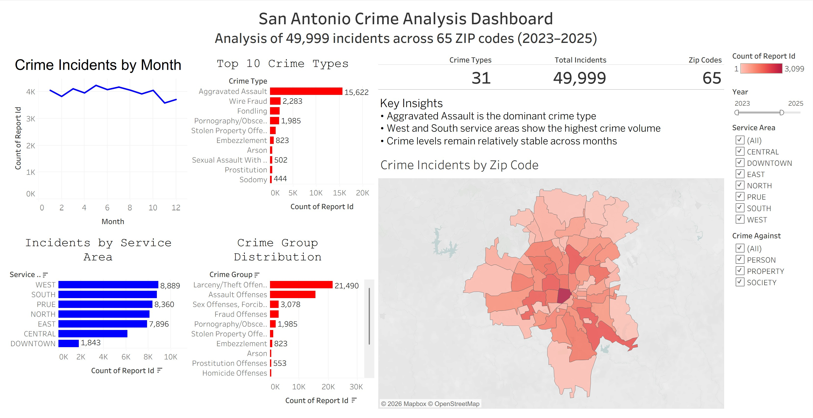

# San Antonio Crime Intelligence Dashboard

## Project Overview
This project analyzes crime incidents in San Antonio using SQL and Tableau to uncover patterns in crime type, geographic distribution, and temporal trends. The goal of this analysis was to transform raw crime data into an interactive dashboard that provides insights into crime activity across the city.

The final dashboard allows users to explore crime patterns by time, location, and offense category while highlighting key hotspots and trends.

---

## Dashboard Preview


---

## Tools Used

| Tool | Purpose |
|-----|-----|
| SQLite | Data cleaning and transformation |
| SQL | Feature engineering and aggregation |
| Tableau | Data visualization and dashboard development |
| GitHub | Portfolio hosting and version control |

---

## Dataset
The dataset contains reported crime incidents from the San Antonio Police Department including:

- Incident report ID
- Report date
- Crime type
- Crime category (crime against)
- Police service area
- Crime group classification
- ZIP code location
- Incident timestamp

This dataset was cleaned and prepared for analysis using SQL.

---

## Data Cleaning Process (SQL)

The raw dataset was transformed into an analysis-ready table using the following steps:

1. Created a cleaned analysis table (`crime_clean`) from the raw dataset.
2. Standardized date fields for time-based analysis.
3. Generated time intelligence fields including:
   - Year
   - Month
   - Day of week
4. Verified data quality and validated the distribution of records.

Example SQL transformation:

```sql
CREATE TABLE crime_clean AS
SELECT
    Report_ID,
    DATE(Report_Date) AS report_date,
    NIBRS_Code_Name AS crime_type,
    NIBRS_Crime_Against AS crime_against,
    Service_Area AS service_area,
    NIBRS_Group AS crime_group,
    Zip_Code AS zip_code,
    DATETIME(DateTime) AS incident_datetime
FROM crime_raw;
```

Time features were added to support trend analysis:

```sql
ALTER TABLE crime_clean ADD COLUMN year INTEGER;
ALTER TABLE crime_clean ADD COLUMN month INTEGER;
ALTER TABLE crime_clean ADD COLUMN day_of_week INTEGER;

UPDATE crime_clean
SET
    year = CAST(strftime('%Y', report_date) AS INTEGER),
    month = CAST(strftime('%m', report_date) AS INTEGER),
    day_of_week = CAST(strftime('%w', report_date) AS INTEGER);
```

---

## Dashboard Features

The Tableau dashboard provides multiple analytical views:

### Crime Incidents by Month
Shows how crime activity fluctuates throughout the year.

### Top 10 Crime Types
Ranks the most common crime types reported in San Antonio.

### Incidents by Service Area
Highlights which police service areas experience the highest crime volume.

### Crime Group Distribution
Shows broader categories of criminal activity.

### Crime Hotspot Map
A choropleth map visualizing crime intensity by ZIP code.

### Key Performance Indicators (KPIs)

- Total Incidents: 49,999
- Crime Types: 31
- ZIP Codes with reported crime: 65

Interactive filters allow users to explore the data by:

- Year
- Service Area
- Crime Against category

---

## Key Insights

- Aggravated Assault is the most frequently reported crime type in the dataset.
- Western and southern service areas show the highest crime volumes.
- Crime levels remain relatively consistent throughout the year with slight seasonal variation.
- Central ZIP codes exhibit higher concentrations of reported incidents.

---

## Skills Demonstrated

- Data cleaning and transformation using SQL
- Feature engineering for time-based analysis
- Exploratory data analysis
- Data visualization and dashboard design
- Geographic data visualization
- Interactive dashboard development
- Data storytelling and insight communication

---

## Repository Structure

```
san-antonio-crime-dashboard
│
├── data
│   └── sapd_offenses_sample.csv
│
├── sql
│   └── crime_cleaning.sql
│
├── tableau
│   └── san_antonio_crime_dashboard.twbx
│
├── images
│   └── dashboard_preview.png
│
└── README.md
```

---

## Future Improvements

Potential future enhancements include:

- Adding time-of-day crime analysis
- Incorporating population data to calculate crime rates
- Adding predictive crime trend modeling
- Expanding geographic analysis to census tract level

---

## Author

Albino Rodriguez  
MBA – Data Analytics  
Information Systems Graduate – University of Texas Rio Grande Valley
